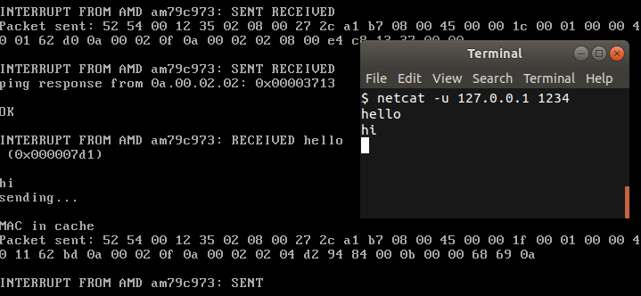
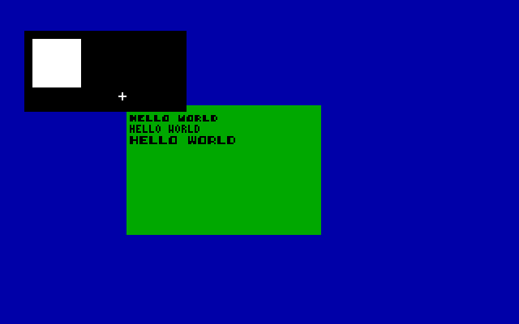

# CairnOS
CairnOS is a basic operating system built from the Youtube tutorial channel [Write your own Operating System](https://www.youtube.com/channel/UCQdZltW7bh1ta-_nCH7LWYw).

It is not designed to be good at anything, but rather to allow me to get a first experience in this field before starting a more serious project.

## Features
### System
 - x86 32 bits
 - round-robin multitasking
 - syscall manager
 - dynamic memory allocation

### Drivers
 - driver manager
 - keyboard
 - mouse
 - networking card (am79c973)
 - VGA

### Networking
 - ARP
 - ICMP
 - UDP

Basic communication through netcat:

### GUI mode
 - Windows
 - Widgets
 - Fonts

Basic Desktop:

